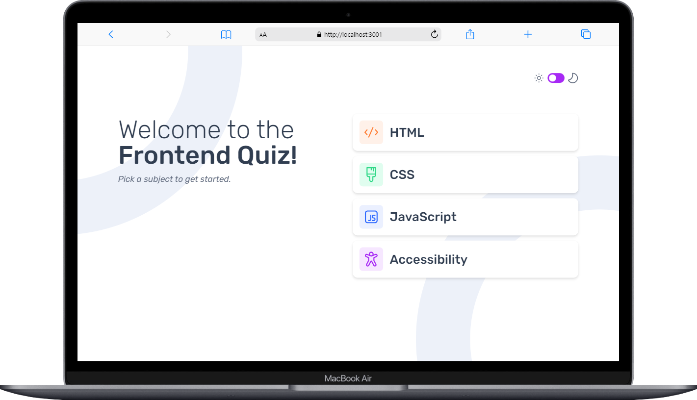

Este é o projeto frontend do Quiz  desenvolvido em [Next.js](https://nextjs.org/)

## Getting Started
Para começar, após clonar este repositório, instale as dependências do projeto:

```bash
npm install
# or
yarn install
# or
pnpm install
```

## Running the app
Para iniciar a aplicação em ambiente de desenvolvimento execute:

```bash
npm run dev
# or
yarn dev
# or
pnpm dev
```

Abra [http://localhost:3000](http://localhost:3000) no seu navegador para visualizar a aplicação em execução.

## Previos screens
Telefone movel


Tablet


Laptop

